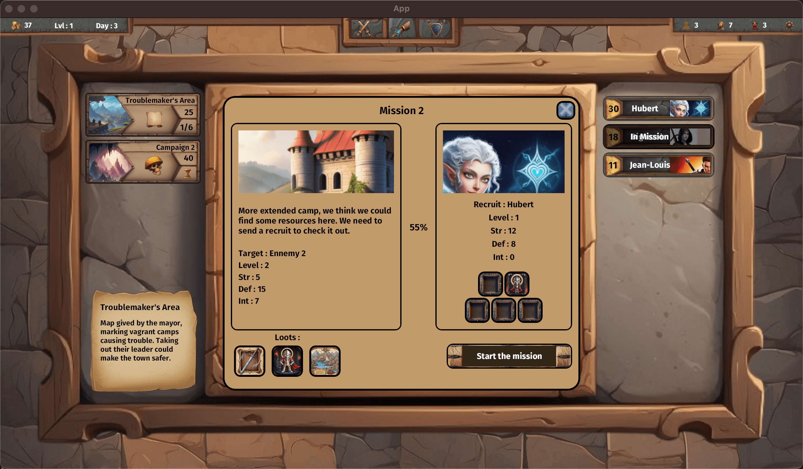

# Welcome to Guild simulator game !

## Guild simulator is full UI game where you are playing a manager of a guild. 

Your goals is to make your guild growing, have stronger recruits, and earn a maximum of golds.

You can hire recruits, manage an inventory of loots you got on success of missions, make golds, make level up your recruits, develop your talents and always find what next mission you will discover through your guild's growing.

## Overview of the barrack

You can manage all your equipments and equip appropriate stuff to your recruits

## Overview of the command room

## Overview of the command room

(All the designs will be changed) Look at all missions you had unlock send recruits make the job for you, after all ... you are just a manager !

